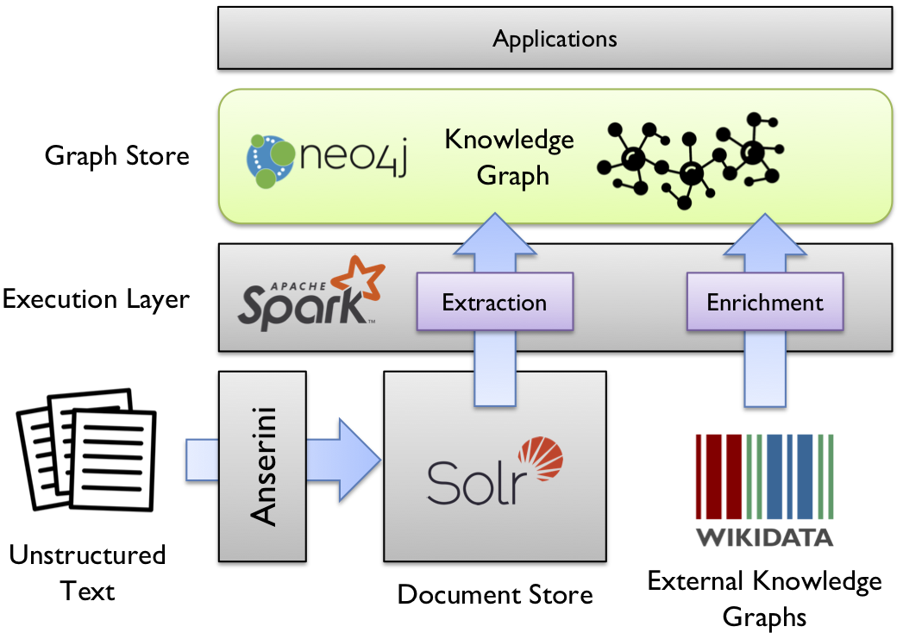

## What is dstlr?

`dstlr` is an open-source platform for scalable, end-to-end knowledge graph construction from unstructured text.
The platform takes a collection of documents, extracts mentions and relations to populate a raw knowledge graph, links mentions to entities in Wikidata, and then enriches the knowledge graph with facts from Wikidata.

While there is plenty of work on relation extraction and complementary tasks such as entity linking, coreference resolution, predicate mapping, there is surprisingly no platform that integrates all the pieces together into a "minimal fuss" solution.
`dstlr` takes advantage of mature open source components:

+ [Apache Solr](https://lucene.apache.org/solr/) as the document store to hold the source documents.
+ [Stanford CoreNLP](https://stanfordnlp.github.io/CoreNLP/) to extract mentions and relations, and to link mentions to entities in Wikidata.
+ [neo4j](https://neo4j.com/) to store the knowledge graph.
+ [Apache Spark](https://spark.apache.org/) to orchestrate all computations for horizontal scaling.

On top of our platform, it is possible to build a number of applications, for example, to support business intelligence, knowledge discovery, and semantic search.
As a very simple demo application, we have implemented a subgraph-matching approach to align extracted relations with facts from Wikidata using the declarative Cypher query language.
This simple demo shows that fact verification, locating textual support for asserted facts, detecting inconsistent and missing facts, and extracting distantly-supervised training data can all be performed within the same framework.

Give `dstlr` [a try](https://github.com/dstlry/dstlr)!
